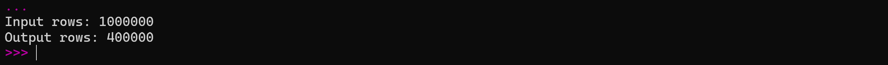
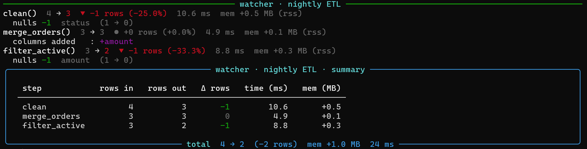

<p align="center">
  
</p>

> **The silent data watcher.** Decorates your pipeline functions and tells you exactly what happened to your data — row counts, schema drift, null changes, memory usage, join explosions — automatically, with zero config.

[](https://pypi.org/project/dfwatcher/)
[](https://pypi.org/project/dfwatcher/)
[](https://github.com/Abineshabee/watcher/actions)
[](LICENSE)
[](https://doi.org/10.5281/zenodo.20286838)
[](https://github.com/Abineshabee/watcher/releases)
---

## The problem

You run a data pipeline. The output is wrong — but the real problem is you don’t know where it went wrong.

```python
import pandas as pd

df = pd.DataFrame({
    "customer_id": range(1, 1000001),
    "status": (["active"] * 700000) + (["inactive"] * 300000),
    "amount": [100] * 1000000
})

orders = pd.DataFrame({
    "customer_id": range(1, 400001),  # 400,000 rows
    "order_value": range(1, 400001)
})

print("Input rows:", len(df))

df = df[df["status"] == "active"]
df = df.merge(orders, on="customer_id", how="inner")
df = df.dropna()

print("Output rows:", len(df))
```

**Output**

<p align="center">
  
</p>

```
You can see the final number.  
But not the story behind it.
```

Which step dropped the rows? Was it a filter, a null drop, or a bad join? You have no idea without adding print statements everywhere and re-running the whole thing.

**watcher answers that — automatically.**

---

## Install

```bash
pip install dfwatcher                 # core only (pandas)
pip install "dfwatcher[rich]"         # + coloured terminal output
pip install "dfwatcher[full]"         # + Rich + psutil memory tracking
```

---

## Quickstart

```python
import pandas as pd
from watcher import watch, session

raw = pd.DataFrame({
    "customer_id": [1, 2, 3, 4],
    "status": ["active", "inactive", "active", None]
})

orders = pd.DataFrame({
    "customer_id": [1, 3],
    "amount": [250.0, 150.0]
})

@watch
def clean(df):
    return df.dropna()

@watch
def merge_orders(df):
    return df.merge(orders, on="customer_id", how="left")

@watch
def filter_active(df):
    return df[df["status"] == "active"]

# 3. Run the session to see the watcher summary!
if __name__ == "__main__":
    with session("nightly ETL") as s:
        df = clean(raw)
        df = merge_orders(df)
        df = filter_active(df)

#=====================================
# For more Examples    : exammples/
# For Syntax and Usage : docs/usage.md
# ====================================
```

**Output — automatically, no extra code:**

<p align="center">
  
</p>

---

## Documentation

- [Features](docs/features.md) **( Example with Sample Output )**
- [Usage Guide](docs/usage.md)
- [API Reference](docs/index.md)
- [Examples](examples/)

---

For advanced pipeline patterns and debugging workflows, see the full documentation.

---

## Development

```bash
git clone https://github.com/Abineshabee/watcher.git
cd watcher
pip install -e ".[dev]"
pytest tests/ -v --cov=watcher
```

CI runs on Python 3.10–3.13 across Ubuntu, Windows, and macOS on every push.

---

## Roadmap

- Polars backend
- DuckDB backend
- Notebook / HTML renderer
- JSON handler for structured logging pipelines
- `watcher.config` — global defaults without decorator arguments

---

## License

MIT — see [LICENSE](LICENSE).
