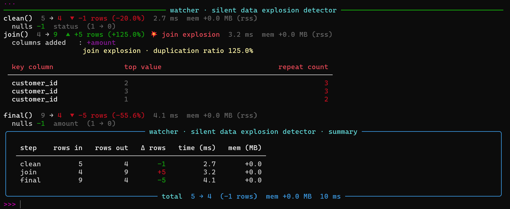

<p align="center">
  
</p>

> **The silent data watcher.** Decorates your pipeline functions and tells you exactly what happened to your data — row counts, schema drift, null changes, memory usage, join explosions — automatically, with zero config.

[](https://pypi.org/project/dfwatcher/)
[](https://pypi.org/project/dfwatcher/)
[](https://github.com/Abineshabee/watcher/actions)
[](LICENSE)
[](https://doi.org/10.5281/zenodo.20286838)
[](https://github.com/Abineshabee/watcher/releases)
---

## The problem

You run a data pipeline. The output looks wrong. Your only clue:

```
Input:  1,000,000 rows
Output:   263,979 rows
```

Which step dropped the rows? Was it a filter, a null drop, or a bad join? You have no idea without adding print statements everywhere and re-running the whole thing.

**watcher answers that — automatically.**

---

## Install

```bash
pip install dfwatcher                 # core only (pandas)
pip install "dfwatcher[rich]"         # + coloured terminal output
pip install "dfwatcher[full]"         # + Rich + psutil memory tracking
```

---

## Quickstart

```python
import pandas as pd
from watcher import watch, session

raw = pd.DataFrame({
    "customer_id": [1, 2, 3, 4],
    "status": ["active", "inactive", "active", None]
})

orders = pd.DataFrame({
    "customer_id": [1, 3],
    "amount": [250.0, 150.0]
})

@watch
def clean(df):
    return df.dropna()

@watch
def merge_orders(df):
    return df.merge(orders, on="customer_id", how="left")

@watch
def filter_active(df):
    return df[df["status"] == "active"]

# 3. Run the session to see the watcher summary!
if __name__ == "__main__":
    with session("nightly ETL") as s:
        df = clean(raw)
        df = merge_orders(df)
        df = filter_active(df)

#=====================================
# For more Examples    : exammples/
# For Syntax and Usage : docs/usage.md
# ====================================
```

**Output — automatically, no extra code:**

<p align="center">
  
</p>

---

## Documentation

- [Usage Guide](docs/usage.md)
- [API Reference](docs/index.md)
- [Examples](examples/)

---

For advanced pipeline patterns and debugging workflows, see the full documentation.
## Features

### Row tracking

Every decorated function shows rows before → after, the signed diff, percentage change, and elapsed time. Nothing is hidden, nothing needs configuring.

```
drop_nulls()  1,000,000 → 921,330  ▼ -78,670 rows (-7.9%)  68.5 ms
```

---

### Null-count deltas

Per-column null counts are compared before and after each step. The worst offenders are shown first.

```
drop_nulls()  1,000,000 → 921,330  ▼ -78,670 rows (-7.9%)
  nulls -2,477  status   (2,477 → 0)
  nulls -1,448  revenue  (1,448 → 0)
```

---

### Schema drift

Columns added or removed between steps are detected and reported immediately.

```
add_revenue_band()  582,246 → 582,246  ● +0 rows
  columns added   : +revenue_band

drop_temp_columns() 582,246 → 582,246  ● +0 rows
  columns removed : -created_at
```

---

### Dtype change detection

If a step changes a column's dtype — widening (`int32` → `int64`) or narrowing (`float64` → `object`) — watcher flags it.

```
coerce_step()  10,000 → 10,000  ● +0 rows
  dtype change : customer_id  int64 → object
```

---

### Join explosion detection

When a merge fans out unexpectedly, watcher tells you which key column caused it, which values are duplicated, and how many times — not just that rows were gained.

<p align="center">
  
</p>

---

### Threshold guards

Turn watcher into a data contract enforcer. Set soft warnings or hard stops on row gain or loss.

```python
@watch(
    warn_on_loss=0.05,    # ⚠  warn  if > 5 %  rows lost
    raise_on_loss=0.20,   # ✗  raise if > 20 % rows lost
    warn_on_gain=0.10,    # ⚠  warn  if > 10 % rows gained
    raise_on_gain=1.00,   # ✗  raise if rows more than double
)
def merge_orders(df):
    return df.merge(orders, on="customer_id", how="left")
```

Catching exceptions in CI:

```python
from watcher.exceptions import ThresholdExceeded, WatcherWarning

try:
    result = pipeline(df)
except ThresholdExceeded as exc:
    logger.error("Data contract violated: %s", exc)
    raise
```

---

### Memory tracking

```python
@watch(track_memory="rss")    # process RSS via psutil  — captures NumPy/pandas C allocations
@watch(track_memory="peak")   # Python-heap peak via tracemalloc — no psutil needed
@watch(track_memory="off")    # disabled — zero overhead for production pipelines
@watch(track_memory=True)     # alias for "rss"
@watch(track_memory=False)    # alias for "off"
```

Example output with RSS tracking on a 1M-row allocation:

```
big_allocation()  1,000,000 → 1,000,000  ● +0 rows  56.2 ms  mem +38.5 MB (rss)
  columns added : +col1, +col2, +col3, +col4, +col5
```

---

### Session grouping

Group multiple steps into one named pipeline run. Get a full summary table and a machine-readable dict for CI assertions.

```python
with session("user churn model — daily run") as s:
    df = clean(df)
    df = merge(df)
    df = score(df)

summary = s.summary()
assert summary["total_rows_out"] > 500_000, "Too many rows dropped!"
print(summary["total_elapsed_s"])
```

`summary()` returns:

```python
{
    "name": "user churn model — daily run",
    "steps": [
        {"func": "clean",  "rows_in": 1000000, "rows_out": 964203, "diff": -35797, ...},
        {"func": "merge",  ...},
        {"func": "score",  ...},
    ],
    "total_rows_in":        1000000,
    "total_rows_out":        631822,
    "total_elapsed_s":        0.072,
    "total_memory_delta_mb":  +38.5,
}
```

---

### Custom handlers

Swap or extend the output layer without touching your pipeline code. Every step fires `on_step()` on all registered handlers.

```python
from watcher import register_handler, deregister_handler
from watcher.handlers import HandlerBase
from watcher.core import StepResult
import json

class JSONLogHandler(HandlerBase):
    def __init__(self):
        self.log = []

    def on_step(self, step: StepResult):
        self.log.append({
            "step":     step.func_name,
            "rows_in":  step.rows_in,
            "rows_out": step.rows_out,
            "diff":     step.row_diff,
            "ms":       round(step.elapsed_s * 1000, 2),
        })

handler = JSONLogHandler()
register_handler(handler)

# ... run your pipeline ...

deregister_handler(handler)
print(json.dumps(handler.log, indent=2))
```

---

## API reference

### `@watch`

```python
@watch(
    label:         str   | None = None,          # custom step name shown in output
    warn_on_loss:  float | None = None,          # soft warning threshold (0.0–1.0)
    raise_on_loss: float | None = None,          # hard stop threshold   (0.0–1.0)
    warn_on_gain:  float | None = None,          # soft warning on row gain
    raise_on_gain: float | None = None,          # hard stop on row gain
    track_memory:  bool | str | MemoryMode = "rss",
    verbose:       bool = True,                  # False = silent, step still tracked in session
)
```

Can be used bare (`@watch`) or with arguments (`@watch(warn_on_loss=0.05)`).

---

### `session(name)`

Context manager. Groups `@watch` steps into one named pipeline run and prints a summary table on exit. Access `.summary()` on the session object for machine-readable results.

---

### `MemoryMode`

| Value | Meaning |
|---|---|
| `"rss"` / `True` | Process RSS via psutil — captures NumPy, pandas, Arrow C allocations |
| `"peak"` | Python-heap peak via tracemalloc — no extra dependencies |
| `"off"` / `False` | Disabled — zero overhead |

---

### `StepResult` attributes

| Attribute | Type | Description |
|---|---|---|
| `func_name` | `str` | Decorated function name (or `label`) |
| `rows_in` | `int` | Row count before the step |
| `rows_out` | `int` | Row count after the step |
| `row_diff` | `int` | Signed difference (`rows_out - rows_in`) |
| `row_diff_pct` | `float` | Fractional change relative to input |
| `lost_rows` | `bool` | True when rows were dropped |
| `gained_rows` | `bool` | True when rows were added |
| `is_join_explosion` | `bool` | True when a fan-out was detected |
| `elapsed_s` | `float` | Wall-clock time in seconds |
| `memory_delta_mb` | `float` | Memory change in MB |
| `memory_mode` | `MemoryMode` | Which memory strategy was used |
| `warned` | `bool` | True when a `warn_on_*` threshold fired |
| `stats` | `StepStats` | Full column-level stats (nulls, dtypes, schema drift) |

---

### Exceptions

| Exception | When |
|---|---|
| `ThresholdExceeded` | A `raise_on_*` threshold is breached — hard stop |
| `WatcherWarning` | A `warn_on_*` threshold is breached — soft, pipeline continues |
| `ConfigurationError` | Invalid decorator arguments at decoration time |
| `BackendError` | A backend adapter failed at runtime |

All exceptions inherit from `WatcherError` so you can catch the entire family with one clause.

---

### `HandlerBase`

| Method | Called when |
|---|---|
| `on_session_start(session)` | A `session()` block opens |
| `on_step(step)` | A decorated function completes |
| `on_session_end(session)` | A `session()` block closes |

---

## Examples

```bash
python examples/basic_pipeline.py     # 1M-row e-commerce ETL with session summary
python examples/threshold_demo.py     # all four threshold modes demonstrated
```

---

## Development

```bash
git clone https://github.com/Abineshabee/watcher
cd watcher
pip install -e ".[dev]"
pytest tests/ -v --cov=watcher
```

CI runs on Python 3.10–3.13 across Ubuntu, Windows, and macOS on every push.

---

## Roadmap

- Polars backend
- DuckDB backend
- Notebook / HTML renderer
- JSON handler for structured logging pipelines
- `watcher.config` — global defaults without decorator arguments

---

## License

MIT — see [LICENSE](LICENSE).
